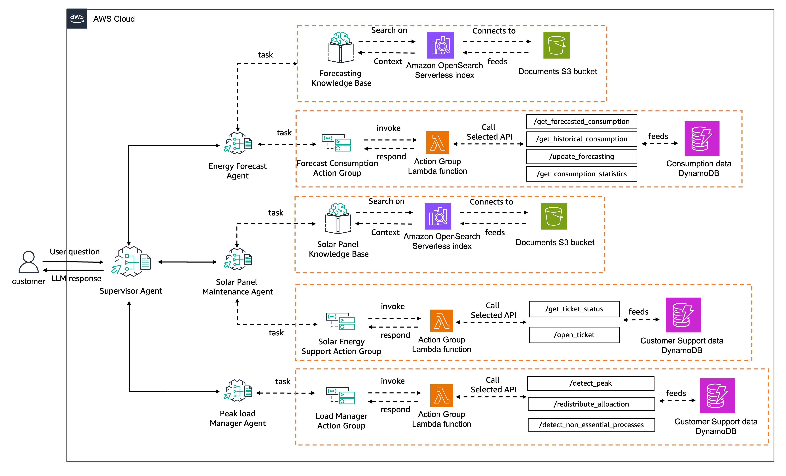

## Amazon Bedrock Multi-agent Collaboration Workshop

This hands-on workshop demonstrates how to build and implement collaborations between multiple AI agents using Amazon Bedrock. 

[Amazon Bedrock](https://aws.amazon.com/bedrock/) is a fully managed service that offers a choice of high-performing foundation models (FMs) from leading AI companies like AI21 Labs, Anthropic, Cohere, Meta, Mistral AI, Stability AI, and Amazon through a single API, along with a broad set of capabilities you need to build generative AI applications with security, privacy, and responsible AI.

Participants will learn how to develop systems where different AI agents work together to solve complex problems, utilizing the foundation models available in Bedrock. 

### Use Case

This multi-agent system optimizes energy consumption and maintenance in large facilities, integrating external weather data and internal energy usage metrics.


### What you'll learn:
- Amazon Bedrock setup and configuration
- Creating and managing multiple AI agents
- Implementing multi-agent collaboration on Amazon Bedrock

### Creating virtual environment

If you would like to run it locally, you can create a virtual environment with Python 3:

```bash
python3 -m venv .env
source .env/bin/activate
```

And then, install dependencies from requirements file:

```bash
pip install -r requirements.txt
```

### Labs

Following are the recommended step-by-step to create individual agents and then, on Lab 4, create the multi-agent collaborator, that will integrates all sub-agents.

1. [Energy Forecast](1-energy-forecast/1_forecasting_agent.ipynb)
1. [Solar Panel](2-solar-panel/2_solar_panel.ipynb)
1. [Peak Load Manager](3-peak-load-manager/3_peak_load_manager.ipynb)
1. [Energy Agent Collaborator](4-energy-agent-collaborator/4.1_energy_agent_collaborator.ipynb)

### Architecture

This is the workshop architecture considering all steps, after create individual agents and multi-agent collaborator.



## Security

See [CONTRIBUTING](CONTRIBUTING.md#security-issue-notifications) for more information.

## License

This library is licensed under the MIT-0 License. See the LICENSE file.

